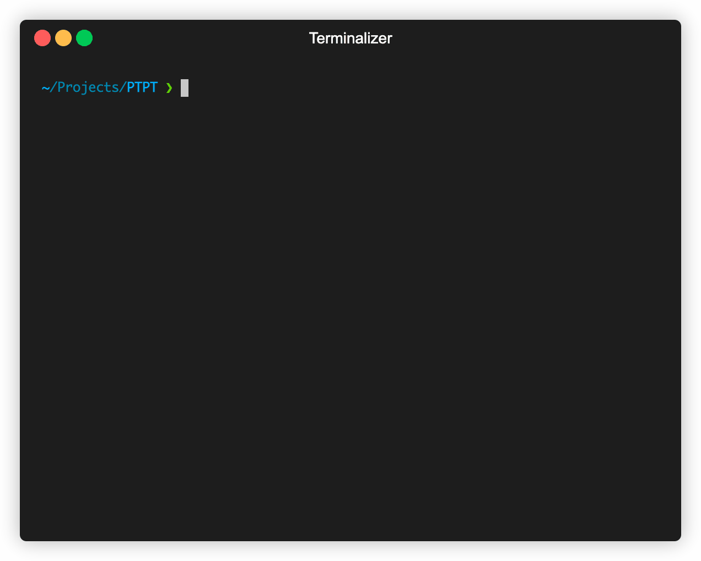

# PTPT - Prompt To Plain Text

English | [简体中文](README_zh.md)

## Introduction

PTPT is an command-line tool that allows you to easily convert plain text files using pre-defined prompts with the help of ChatGPT. 
With PTPT, you can effortlessly create and share prompt formats, making collaboration and customization a breeze. 
Plus, by subscribing, you gain access to even more prompts to enhance your experience.
If you're interested in prompt engineering, you can use PTPT to develop and share your prompts.

## Features

- Let ChatGPT handle plain text files for you!
- Predefined prompts (currently with `14` prompts, contributions welcome!)
- Convenient sharing and extension of prompts format
- 🌟Get more prompts by subscribing
- 🌟Develop and manage your prompts
- Use via proxy

List of Prompts currently supported:

- [x] 🧸Role-playing (for entertainment only) - [role_play](docs/prompts/role_play.md)
- [x] 🧸Greeting (for entertainment only) - [hello](docs/prompts/hello.md)
- [x] 📝Translate Markdown - [translate](docs/prompts/translate.md)
- [x] 📝Translate csv to csv - [translate](docs/prompts/translate.md)
- [ ] 📝Translate csv to GNU po (WIP)
- [x] 💻Code review - [code_review](docs/prompts/code_review.md)
- [x] 💻Convert json to go struct - [json_converter](docs/prompts/json_converter.md)
- [x] 📝Generate prompt documentation - [prompt_doc](docs/prompts/prompt_doc.md)
- [x] 💻Generate gorm struct - [sql](docs/prompts/sql.md)
- [x] 💻Generate regular expression - [regex](docs/prompts/regex.md)


## Installation

```bash
go install github.com/leslieleung/ptpt
```

## Usage

For first-time use, please configure `api_key` and `proxy_url` (optional) according to the wizard.

### Subscribe Prompts

```bash
> ptpt prompt subscribe https://raw.githubusercontent.com/LeslieLeung/pt-collection/main/awesome-chatgpt-prompts/awesome-chatgpt-prompts.yaml
```

This subscribes to all prompts from [f/awesome-chatgpt-prompts](https://github.com/f/awesome-chatgpt-prompts).

More subscriptions will be updated in the future. Please follow [pt-collection](https://github.com/LeslieLeung/pt-collection), which will automatically update upstream prompts every day at UTC 0.

### Interactive

Several useful prompts have already been pre-installed, with more to come in future updates. Additional prompts can also be obtained through subscribing.

```bash
> ptpt run
```



### CLI

```bash
ptpt run [prompt] [inFile] [outFile]

# Redirect
> ptpt run translate-markdown Hello.md > Hello_tranlsated.md
# Or write to file
> ptpt run translate-markdown Hello.md Hello_tranlsated.md
```

### Create your own prompt

#### Interactively
```bash
> ptpt prompt create
```

The generated prompt yaml would be saved to `ptpt/prompt` directory.

#### Syntax

```yaml
version: v0 # version of prompt yaml, currently v0
prompts: # your defined prompt
  - name: role-yoda # prompt name
    description: "Role Play as Yoda" # prompt description
    system: You are Yoda master from Star Wars, speak in his tongue you must. # system 指令
  - name: role-spock
    description: "Role Play as Spock"
    system: You are Spock from Star Trek, you must speak in his tongue.
```

By downloading and saving shared prompts to the `ptpt/prompt` directory, more prompts can be used.

### Generating Prompt Documents

```bash
> ptpt run prompt-doc prompt.yaml > prompt.md
```

## Configuration File

The default configuration file directory for `ptpt` is as follows, and is currently not customizable.

```
Windows: %APPDATA%\ptpt
macOS: $HOME/Library/Application Support/ptpt
Linux: $HOME/.config/ptpt
```

## Roadmap
- [x] Support proxy configuration
- [ ] Optimize user experience
- [ ] Support ChatGPT parameter configuration
- [ ] PromptHub - Share prompts through yaml files
- [ ] Support more prompts
- [ ] Support extra long texts

## Credits
This project is inspired by [sigoden/aichat](https://github.com/sigoden/aichat). The original project was written in Rust, but due to my limited abilities, I wanted to create my own version using my familiar technology stack.