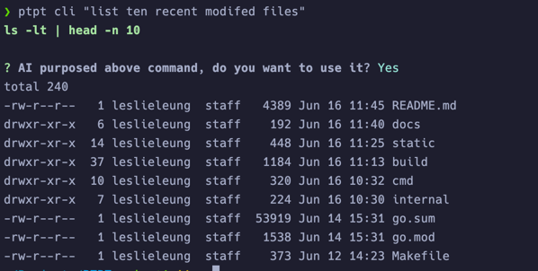

# PTPT - Prompt To Plain Text

English | [简体中文](README_zh.md)

[](https://sonarcloud.io/summary/new_code?id=LeslieLeung_PTPT)

## Introduction

PTPT is a command-line tool that allows you to easily convert plain text files using pre-defined prompts with the help of ChatGPT. 
With PTPT, you can effortlessly create and share prompt formats, making collaboration and customization a breeze. 
Plus, by subscribing, you gain access to even more prompts to enhance your experience.
If you're interested in prompt engineering, you can use PTPT to develop and share your prompts.

## Features

- `lint` Lint your code to find potential problems.
- `commit` Generate commit message.
- `chat` Chat with ChatGPT in terminal.
- `cli` A copilot cli like experience tool. Generate and run cli commands with natural language.
- `run` Run prompt to process plain text files.
- `prompt` Create your own prompt or subscribe to prompts.

## Installation

```bash
go install github.com/leslieleung/ptpt@latest
```

Or download from [Release](https://github.com/LeslieLeung/PTPT/releases)

## Usage

### First Time Setup

For first-time use, please configure `api_key` and `proxy_url` (optional) according to the wizard.

```bash
> ptpt
```

### Lint Code

```bash
> ptpt lint <path>
```


> *As of `v0.1.5` , you can use the diff feature to lint the changes in the git repository.*
> 
> *This feature relies on git, make sure `git` is usable.*

```bash
> ptpt lint -d # default to HEAD
> ptpt lint -d <other git diff params>
```

### Generate Commit Message

```bash
> ptpt commit
```

### Chat With ChatGPT

```bash
> ptpt chat
```

### Copilot Cli

```bash
> ptpt cli "List 10 recent modified files in current directory"
```



### Subscribe Prompts

```bash
> ptpt prompt subscribe https://raw.githubusercontent.com/LeslieLeung/pt-collection/main/awesome-chatgpt-prompts/awesome-chatgpt-prompts.yaml
```

This subscribes to all prompts from [f/awesome-chatgpt-prompts](https://github.com/f/awesome-chatgpt-prompts).

More subscriptions will be updated in the future. Please follow [pt-collection](https://github.com/LeslieLeung/pt-collection), which will automatically update upstream prompts every day at UTC 0.

### Interactive

Several useful prompts have already been pre-installed, with more to come in future updates. Additional prompts can also be obtained through subscribing.

```bash
> ptpt run
```


### Run Prompt

```bash
ptpt run [prompt] [inFile] [outFile]

# Redirect
> ptpt run translate-markdown Hello.md > Hello_tranlsated.md
# Or write to file
> ptpt run translate-markdown Hello.md Hello_tranlsated.md
```

### Prompt Management

#### Create Your Own Prompt(Interactively)

```bash
> ptpt prompt create
```

The generated prompt yaml would be saved to `ptpt/prompt` directory.

#### Prompt File Syntax

```yaml
version: v0 # version of prompt yaml, currently v0
prompts: # your defined prompt
  - name: role-yoda # prompt name
    description: "Role Play as Yoda" # prompt description
    system: You are Yoda master from Star Wars, speak in his tongue you must. # system 指令
  - name: role-spock
    description: "Role Play as Spock"
    system: You are Spock from Star Trek, you must speak in his tongue.
```

By downloading and saving shared prompts to the `ptpt/prompt` directory, more prompts can be used.

#### Generating Prompt Documents

```bash
> ptpt run prompt-doc prompt.yaml > prompt.md
```

### Global Settings

#### Set Temperature

Set the temperature of ChatGPT, range from 0.0 ~ 1.0. The default value is `0.7`.

```bash
> ptpt <cmd> -t 0.8
```

#### Set Model

Set model to use. The default value is `gpt-3.5-turbo-0613`.

```bash
> ptpt <cmd> -m gpt-4
```

For the full list of models, please refer to [HERE](https://github.com/sashabaranov/go-openai/blob/master/completion.go)

## Configuration File

The default configuration file directory for `ptpt` is as follows, and is currently not customizable.

```
Windows: %APPDATA%\ptpt
macOS: $HOME/Library/Application Support/ptpt
Linux: $HOME/.config/ptpt
```

## Credits
This project is inspired by [sigoden/aichat](https://github.com/sigoden/aichat). The original project was written in Rust, but due to my limited abilities, I wanted to create my own version using my familiar technology stack.