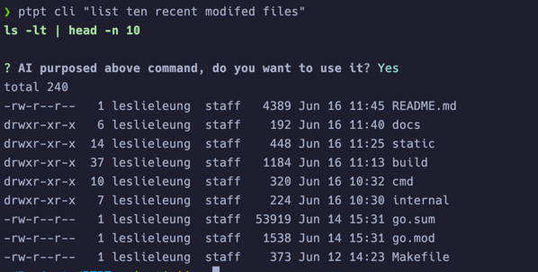

# PTPT - Prompt To Plain Text

[English](README.md) | 简体中文

[](https://sonarcloud.io/summary/new_code?id=LeslieLeung_PTPT)

## 简介

PTPT 是一个命令行工具，旨在为你提供一个简单的方式，让 ChatGPT 处理纯文本文件。
PTPT 提供了多种预定义 prompt，以及方便分享和扩展的 prompt 格式。 通过订阅，你可以获得更多有趣的 prompt！
如果你对 Prompt Engineering 感兴趣，你可以使用 PTPT 开发并分享自己的 prompt。

## 功能

- `lint` 检查代码中的潜在问题。
- `commit` 生成 commit message。
- `chat` 在终端中与 ChatGPT 聊天。
- `cli` 一个类似 copilot cli 的工具。使用自然语言生成和运行命令。
- `run` 运行 prompt 处理纯文本文件。
- `prompt` 创建你自己的 prompt 或订阅 prompt。


## 安装

```bash
go install github.com/leslieleung/ptpt@latest
```

或从 [Release](https://github.com/LeslieLeung/PTPT/releases) 下载

## 使用方法

### 首次使用

初次使用请根据提示配置 `api_key` 和 `proxy_url` （可选）。

```bash
> ptpt
```

### 代码检查

```bash
> ptpt lint <file>
> ptpt lint -l zh <file> # 中文建议
```


> *自 `v0.1.5` 以后, 可以使用 diff 来检查 git 仓库中的代码变更。*
> 
> 此功能依赖 `git`，请保证 `git` 已经安装并配置好。

```bash
> ptpt lint -d # 默认比较 HEAD
> ptpt lint -d <other git diff params>
```

### 生成 commit message

```bash
> ptpt commit
```


### ChatGPT 聊天

```bash
> ptpt chat
```

### 命令生成

```bash
> ptpt cli "列出最近10个修改过的文件"
```



### 订阅 prompt

```bash
> ptpt prompt subscribe https://raw.githubusercontent.com/LeslieLeung/pt-collection/main/awesome-chatgpt-prompts/awesome-chatgpt-prompts.yaml
```

能够订阅 [f/awesome-chatgpt-prompts](https://github.com/f/awesome-chatgpt-prompts) 的所有 prompt。

后续会更新更多的订阅，欢迎关注 [pt-collection](https://github.com/LeslieLeung/pt-collection)，该项目每天 UTC 0 会自动更新同步上游的 prompt。

### 交互式

目前已经预置了几个好用的 prompt，后续会继续增加。同时也可以通过订阅获取更多的 prompt。

```bash
> ptpt run
```


### 通过命令行处理文件
```bash
ptpt run [prompt] [inFile] [outFile]

# 使用重定向
> ptpt run translate-markdown Hello.md > Hello_tranlsated.md
# 或直接指定输出文件
> ptpt run translate-markdown Hello.md Hello_tranlsated.md
```

### Prompt 管理

#### 通过交互式创建

```bash
> ptpt prompt create
```

生成的 prompt yaml 文件会保存在 `ptpt/prompt` 目录下。

#### 格式说明

```yaml
version: v0 # 版本号，暂时为v0
prompts: # 定义的 prompt
  - name: role-yoda # prompt 名称
    description: "Role Play as Yoda" # prompt 描述
    system: You are Yoda master from Star Wars, speak in his tongue you must. # system 指令
  - name: role-spock
    description: "Role Play as Spock"
    system: You are Spock from Star Trek, you must speak in his tongue.
```

通过下载别人分享的 prompt，保存在 `ptpt/prompt` 目录下后，即可使用更多的 prompt。

#### 生成 prompt 文档

```bash
> ptpt run prompt-doc prompt.yaml > prompt.md
```

### 全局配置

#### 设置 Temperature

设置 Temperature 的值，范围为 0.0 ~ 1.0，默认值为 `0.7`。

```bash
> ptpt <cmd> -t 0.8
```

#### 设置模型

设置模型，默认为 `gpt-3.5-turbo-0613`。

```bash
> ptpt <cmd> -m gpt-4
```

模型列表见 [这里](https://github.com/sashabaranov/go-openai/blob/master/completion.go)

## 配置文件

`ptpt` 默认的配置文件目录如下，暂不支持更改。

```
Windows: %APPDATA%\ptpt
macOS: $HOME/Library/Application Support/ptpt
Linux: $HOME/.config/ptpt
```

## Credits
本项目灵感来源于 [sigoden/aichat](https://github.com/sigoden/aichat)，该项目使用 Rust 语言，由于能力有限，我想用自己熟悉的技术栈做一个自己的版本。