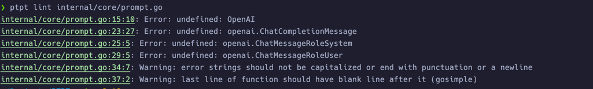

# PTPT - Prompt To Plain Text

[English](README.md) | 简体中文

## 简介

PTPT 是一个命令行工具，旨在为你提供一个简单的方式，让 ChatGPT 处理纯文本文件。
PTPT 提供了多种预定义 prompt，以及方便分享和扩展的 prompt 格式。 通过订阅，你可以获得更多有趣的 prompt！
如果你对 Prompt Engineering 感兴趣，你可以使用 PTPT 开发并分享自己的 prompt。

## 功能

- 让 ChatGPT 替你处理纯文本文件！
- 预定义 prompt （目前已有`18`种 prompt，欢迎贡献！）
- 方便分享和扩展的 prompt 格式
- 🌟通过订阅获得更多 prompt
- 🌟开发更多有用有趣的 prompt，并通过 PTPT 管理你的 prompt
- 通过代理使用
- 🌟使用 ChatGPT 检查你的代码！
- 🌟在终端中与 ChatGPT 聊天！

已经支持的 prompt 一览

- [x] 🧸角色扮演（仅供娱乐）- [role_play](docs/prompts/role_play.md)
- [x] 🧸问候语（仅供娱乐）- [hello](docs/prompts/hello.md)
- [x] 📝Markdown 翻译 - [translate](docs/prompts/translate.md)
- [x] 📝csv 翻译成 csv - [translate](docs/prompts/translate.md)
- [ ] 📝csv 翻译成 GNU po (WIP)
- [x] 💻代码审查 - [code_review](docs/prompts/code_review.md)
- [x] 💻json 转 go 结构体 - [json_converter](docs/prompts/json_converter.md)
- [x] 📝生成 prompt 文档 - [prompt_doc](docs/prompts/prompt_doc.md)
- [x] 💻生成 gorm 结构体 - [sql](docs/prompts/sql.md)
- [x] 💻生成正则表达式 - [regex](docs/prompts/regex.md)
- [x] 💻生成文章摘要和 SEO 关键词


## 安装

```bash
go install github.com/leslieleung/ptpt@latest
```

或从 [Release](https://github.com/LeslieLeung/PTPT/releases) 下载

## 使用案例

### ChatGPT Lint

```bash
> ptpt lint <file>
> ptpt lint -l zh <file> # 中文建议
```



> *自 `v0.1.5` 以后, 可以使用 diff 来检查 git 仓库中的代码变更。*
> 此功能依赖 `git`，请保证 `git` 已经安装并配置好。

```bash
> ptpt lint -d # 默认比较 HEAD
> ptpt lint -d <other git diff params>
```


### ChatGPT 聊天

```bash
> ptpt chat
```

## 使用

初次使用请根据提示配置 `api_key` 和 `proxy_url` （可选）。

### 设置 Temperature

设置 ChatGPT 的 Temperature。 默认值为 `0.7`。

```bash
> ptpt run lint <file> -t 0.8
```

### 订阅 prompt

```bash
> ptpt prompt subscribe https://raw.githubusercontent.com/LeslieLeung/pt-collection/main/awesome-chatgpt-prompts/awesome-chatgpt-prompts.yaml
```

能够订阅 [f/awesome-chatgpt-prompts](https://github.com/f/awesome-chatgpt-prompts) 的所有 prompt。

后续会更新更多的订阅，欢迎关注 [pt-collection](https://github.com/LeslieLeung/pt-collection)，该项目每天 UTC 0 会自动更新同步上游的 prompt。

### 交互式

目前已经预置了几个好用的 prompt，后续会继续增加。同时也可以通过订阅获取更多的 prompt。

```bash
> ptpt run
```


### 通过命令行参数
```bash
ptpt run [prompt] [inFile] [outFile]

# 使用重定向
> ptpt run translate-markdown Hello.md > Hello_tranlsated.md
# 或直接指定输出文件
> ptpt run translate-markdown Hello.md Hello_tranlsated.md
```

### 创造你自己的 prompt

#### 通过交互式创建

```bash
> ptpt prompt create
```

生成的 prompt yaml 文件会保存在 `ptpt/prompt` 目录下。

#### 格式说明

```yaml
version: v0 # 版本号，暂时为v0
prompts: # 定义的 prompt
  - name: role-yoda # prompt 名称
    description: "Role Play as Yoda" # prompt 描述
    system: You are Yoda master from Star Wars, speak in his tongue you must. # system 指令
  - name: role-spock
    description: "Role Play as Spock"
    system: You are Spock from Star Trek, you must speak in his tongue.
```

通过下载别人分享的 prompt，保存在 `ptpt/prompt` 目录下后，即可使用更多的 prompt。

#### 生成 prompt 文档

```bash
> ptpt run prompt-doc prompt.yaml > prompt.md
```

## 配置文件

`ptpt` 默认的配置文件目录如下，暂不支持更改。

```
Windows: %APPDATA%\ptpt
macOS: $HOME/Library/Application Support/ptpt
Linux: $HOME/.config/ptpt
```

## 一些想法

最近各种 ChatGPT 帮写代码的应用层出不穷，但与其让 ChatGPT 帮你写一个能够运行的程序，不如让 ChatGPT 直接承担各种文本生成、格式转换的工作。
对于没有编程基础的人群而言，就算拿到了能用的代码，如何让代码跑起来还需要一番折腾；对于程序员而言，重复做应用不如投入更多精力去开发 prompt。因此，我做了 PTPT，
让 ChatGPT 帮助我完成一些纯文本文件的处理工作，比如 Markdown 翻译、格式转换等。
 
在 PTPT 之前，我开发了一个名为 C3PO 的项目，在 C3PO 中，我需要手动去处理返回的 csv，如果想要支持 GNU po还需要写代码适配。同时，在 v2ex 论坛上，有朋友提出了很好的意见：
根本不需要做一个专门的软件来实现某个功能，开发 prompt 就足够了。这也是 PTPT 希望达到的效果。
 
至于为什么不使用现成的xx项目 / 使用一些 web 版的 ChatGPT 套壳工具，首先很多这些工具已经围绕 prompt 开始收费了，对他们来说 prompt 是核心资产，而我觉得 prompt 也应该是开源共享的。
另外，命令行工具能保持这个项目的操作尽可能简单，而且可以直接输出成文件，不需要再复制粘贴。


## Roadmap
- [x] 支持代理配置
- [ ] 优化使用体验
- [ ] 支持ChatGPT参数配置
- [ ] PromptHub - 通过 yaml 文件分享 prompt
- [ ] 支持更多的 prompt
- [ ] 支持超长文本

## Credits
本项目灵感来源于 [sigoden/aichat](https://github.com/sigoden/aichat)，该项目使用 Rust 语言，由于能力有限，我想用自己熟悉的技术栈做一个自己的版本。